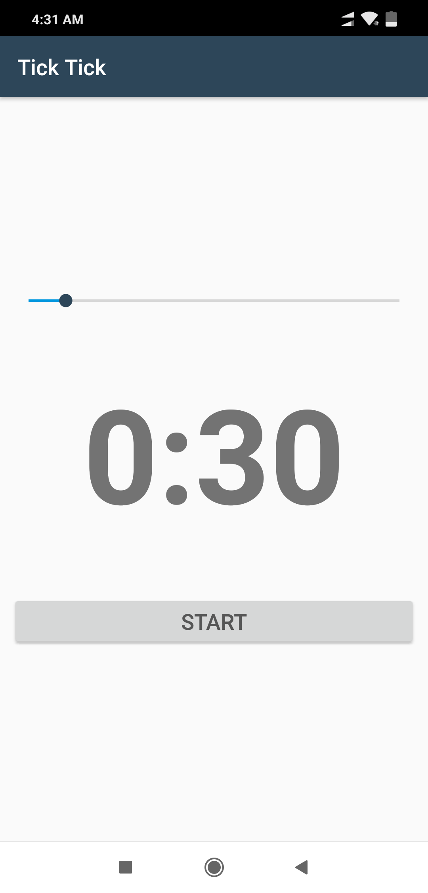

# TickTick

This app uses count down timer and seekbar. CountDownTimer gets the current position of the seekbar and uses the calculated remaining time 
to set the seekbar progress so time and seekbar changes simultaneously. If the time is over then it plays a sound using the media player.

Here are some screenshots from the app.

 |
 |

